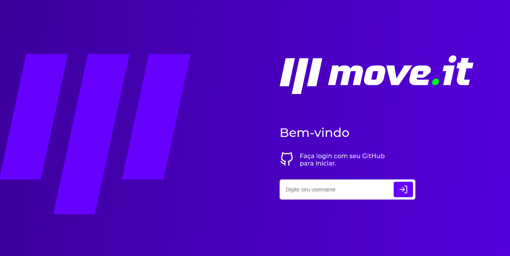

<h1 align="center">
    Time Up | NLW#4
</h1>
<p align="center"> Application developed in the fourth edition of Rocketseat Next Level Week 💻🚀 </p>

<p align="center">
 <a href="#objective">Objective</a> •
 <a href="#technologies">Technologies</a> • 
 <a href="#usage">Usage</a> • 
 <a href="#contribution">Contribution</a> • 
 <a href="#author">Author</a> • 
 <a href="#license">License</a>
</p>

<h1 align="center">
  

</h1>

<h4 align="center"> 
	🚧 Time Up | NLW#4 ⏰📈 Loading...  🚧
</h4>

<h2 id="objective" > 🎯 Objective </h2>

Track your time, be more productive and take care of your health. <a href="https://timeup.vercel.app">TimeUp</a> was developed for time management, as in the pomodoro technique, dividing the work into 25 minute periods. After that time it releases a challenge, which is some stretching for the body or exercise for the eyes. Each challenge has its xp points and, accumulating the points you level up.

The layout of original move.it is available <a href="https://www.figma.com/file/ge20pu3ofMOKoliUyKx1Nl/?viewer=1&node-id=">here</a>.

<h2 id="technologies"> 🛠 Technologies </h2>

The following tools were used in the construction of the project:

- [ReactJS](https://reactjs.org)
- [NextJS](https://nextjs.org)
- [NodeJS](https://nodejs.org/en/)
- [Yarn](https://yarnpkg.com) or Npm
- [VSCode](https://code.visualstudio.com)
- [Git Bash](https://gitforwindows.org/)

<h2 id="usage" > 👷 Usage </h2>

Required! Install git, node and yarn (or npm).

```bash
# Clone Repository
$ git clone https://github.com/oliveira-gabriel/nlw4-moveit.git

# Go to server folder
$ cd nlw4-moveit

# Install Dependencies
$ yarn

# Run Aplication
$ yarn dev

# Access localhost
http://localhost:3000
```

<h2 id="contribution"> 🤝 Contribution </h2>

This project is for study purposes too, so send me an email telling me what you are doing and why you are doing it, teach me what you know. All kinds of contributions are very welcome and appreciated!

<h2 id="author"> 💻 Author </h2>

By Gabriel Oliveira 👋🏽 Find me:

[](https://www.linkedin.com/in/gabrieloliveira472/)
[](mailto:gabrieloliveira472@gmail.com)

<h2 id="license"> 📝 License </h2>

This project is under the MIT license.
